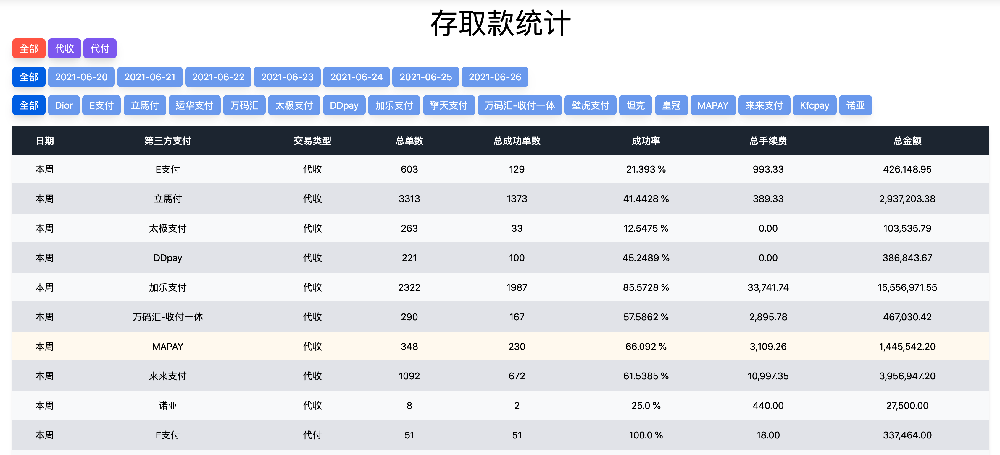

#### Setup Project in Docker

`$ docker-compose up`

#### 環境參數
1. 資料庫: integration_payment_system
1. 帳號密碼: root/qwer4321

#### docker相關
1. 進入docker容器：`docker-compose run app bash`，進去後就是正常的開發環境，可以執行`rails c`、`rails db:migrate`之類的指令
1. 關閉docker: docker-compose down
1. 執行前需要先關閉本地mysql(3306 port)與rails server(port 3000)

#### 考試題目

目標製作報表如下圖

1. order has two kind of service_type:
    1. deposit(代收): payment_type not nil
    2. withdraw(代付): payment_type is nil
1. 欄位解釋
    1. 日期：當周(4/1~4/7)
    1. 第三方支付：顯示出ThirdPartyPayment的Name
    1. 交易類型：將代收與代付分開統計
    1. 總單數：該商戶當週代收 或 代付的總訂單數量
    1. 總成功單數：該商戶當都訂單狀態為paid(已支付)notified(已通知)
    1. 成功率：總成功單數/總單數
    1. 總手續費：成功訂單fee欄位總和
    1. 總金額：成功訂單amount總和
1. 製作一張相同的報表 不需要有上方的filter 也不需要有任何的版面渲染 當計算印出內容在root path即可